<br/>

<div align="center">

[](https://linkedin.com/in/marcusviniciusfc)
[](https://instagram.com/mv.techstudio)
[](https://mv-tech-studio.vercel.app)
[](mailto:marcusv2354@gmail.com)

</div>

---

## `~/sobre-mim`

```js
const marcus = {
  nome:        "Marcus Vinícius",
  local:       "Belo Horizonte, MG 🇧🇷",
  formação:    "Análise e Desenvolvimento de Sistemas @ PUC Minas",
  stack:       ["TypeScript", "React", "Next.js", "C#", ".NET", "Supabase"],
  aprendendo:  ["Angular avançado", "Arquitetura de microsserviços", "Design Systems"],
  foco:        "Construir interfaces bonitas com backends sólidos",
  hobby:       "Transformar café em código desde 2022 ☕",
};
```

---

## `~/stack`

**Front-end**

[](https://skillicons.dev)

**Back-end & Dados**

[](https://skillicons.dev)

**Ferramentas**

[](https://skillicons.dev)

---

## `~/projetos`

<table>
  <tr>
    <td width="33%" valign="top">
      <h3 align="center">🖥️ MV Tech Studio</h3>
      <p align="center">
        Portfólio pessoal com terminal interativo, animações e tema Tokyo Night.
      </p>
      <p align="center">
        
        
        
        
      </p>
      <p align="center">
        <a href="https://mv-tech-studio.vercel.app">
          
        </a>
      </p>
    </td>
    <td width="33%" valign="top">
      <h3 align="center">💅 Fiuza Nails App</h3>
      <p align="center">
        PWA de agendamentos para salão de beleza com pagamento Pix e backend Supabase.
      </p>
      <p align="center">
        
        
        
        
      </p>
      <p align="center">
        
      </p>
    </td>
    <td width="33%" valign="top">
      <h3 align="center">⚡ Projeto EZ</h3>
      <p align="center">
        Aplicação Angular com autenticação, dashboard e gerenciamento de usuários.
      </p>
      <p align="center">
        
        
        
      </p>
      <p align="center">
        
      </p>
    </td>
  </tr>
</table>

---

## `~/github --stats`

<div align="center">


</div>

---

## `~/contato`

<div align="center">

[](https://linkedin.com/in/marcusviniciusfc)
[](https://instagram.com/mv.techstudio)
[](https://mv-tech-studio.vercel.app)
[](mailto:marcusv2354@gmail.com)

<br/>


</div>

---

<div align="center">
  <sub>Feito com 💜 e muita linha de terminal por <strong>Marcus Vinícius</strong></sub>
</div>
